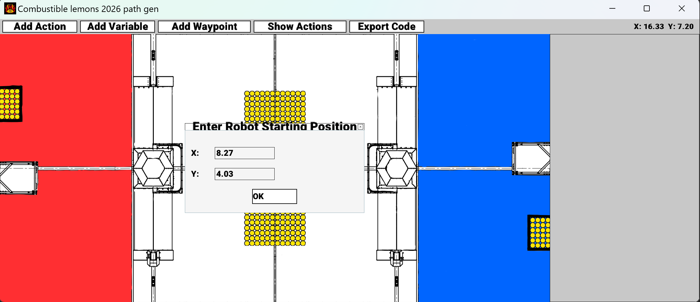
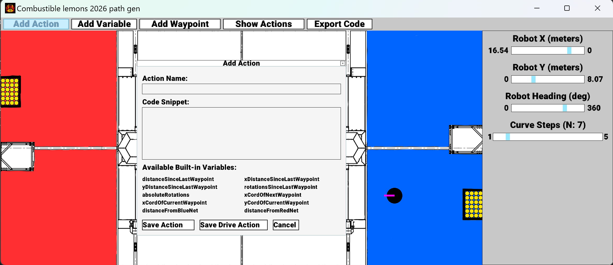
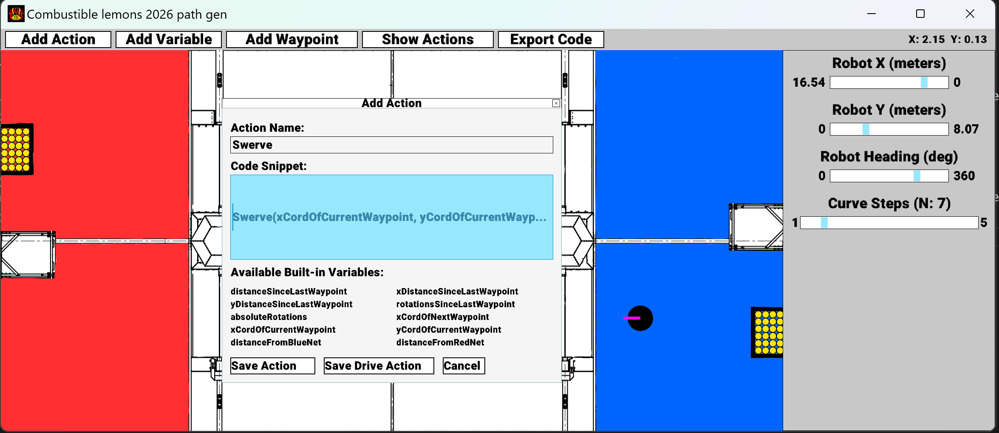
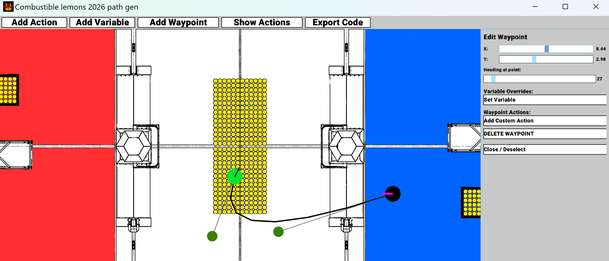
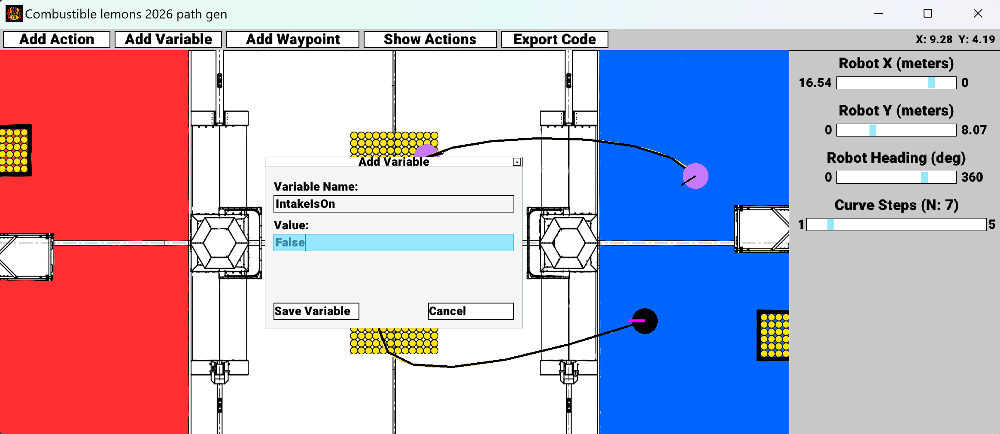
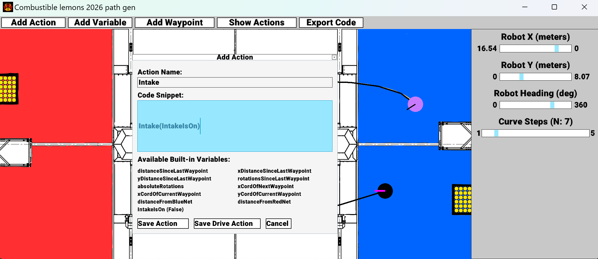
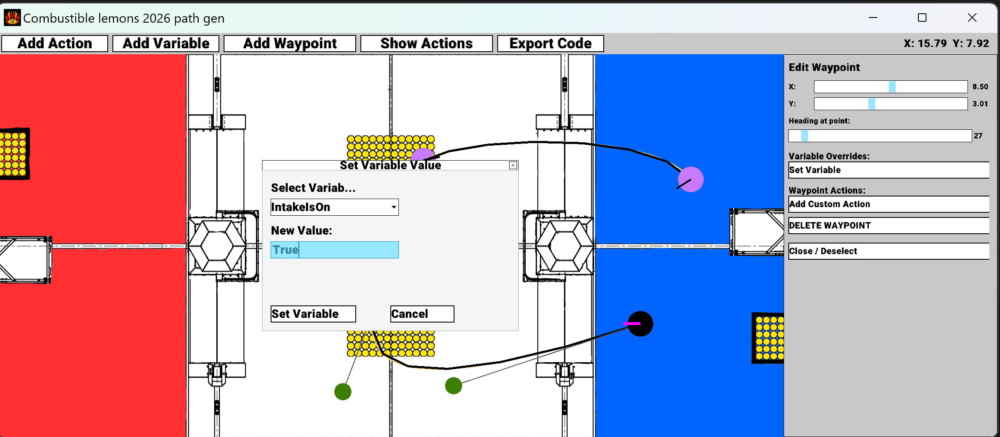
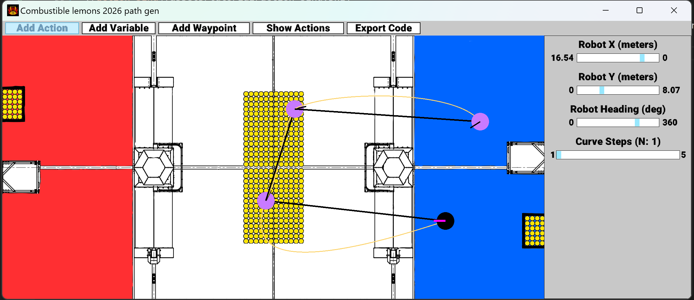
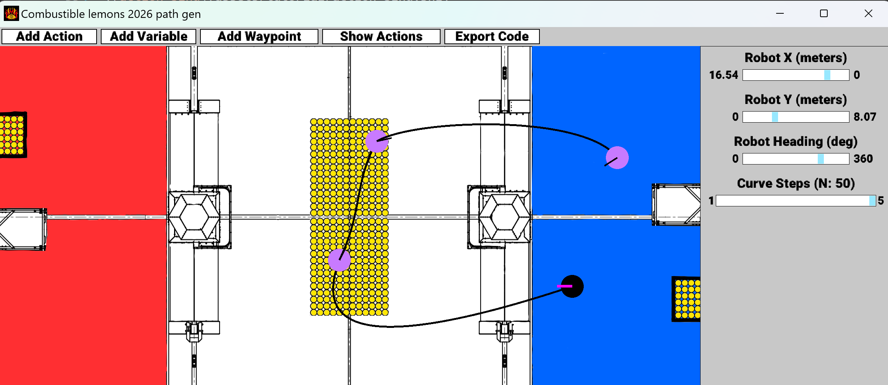
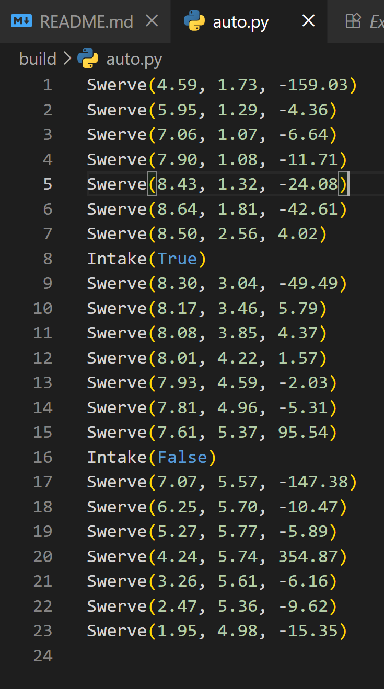

<h2>FRC5113 PATH GEN</h2>
<h3>By Chase Yalon (chaseyalon@gmail.com)</h3>

The basic idea behind PATH GEN is that it is hard to get distances and field relative coordinates right. So let the computer do it for you.
PATH GEN will emit actual code, according to your predefined rules that you crate. Bellow is a brief tutorial.
This is still a VERY VERY early alpha product, and issues and PRs are welcome. Thanks!

<h2>Tutorial</h2>
First download and run the installer from [here](https://github.com/ChaseYalon/AutoPathGen/releases/tag/0.3) (yes I am aware windows does not trust it, I would have to pay for a cert and I am broke)

Now you can now run the program and you will be greeted with this screen

Give your robot a starting location (dont worry, you can change it later). Now click OK and use the first 3 sliders on the side to move around the robot

Now click "Add Action" to bring up the action wizard

In this wizard you can add two types of actions. Regular actions which we will talk about later. For now, give the action a name and give the code to move your robot. This is the most complex part, AUTO GEN, provides several builtin variables, like xCordOfCurrentWaypoint, which as the name implies will evaluate to the to the X coordinate of the current waypoint. So fill it out like this, in a way that works with your auto framework. (Hint: If it is hard to integrate with your framework just use [this one](https://github.com/ChaseYalon/betterAuto))

Click save drive action, meaning that it will be applied to drive. Now add a way point and use the control points to adjust the splines

Feel free to edit the way points properties on the left.
Now add a few more waypoints to complete your paths. Once you are done, lets add another components, say an intake.
First lets set a variable to represent the state of the intake

Now you can save it, and create a new action, notice how our custom variable is available under "Available variables"

Now click save acton, and select the first waypoint. Click set variable to change the value of that variable once the robot reaches that point.

Save it and click custom action, and select our intake action. and click ok. Repeat the process to set the variable to false on the next waypoint to turn off the intake as it leaves the ball

Finally, to adjust how closely the robot follows the bezier curve, set the "N" value on the main control screen

N=1

N=50

N=7 is recommended by default.
Finally to export just click export code, give it a file name, and here is the result.
